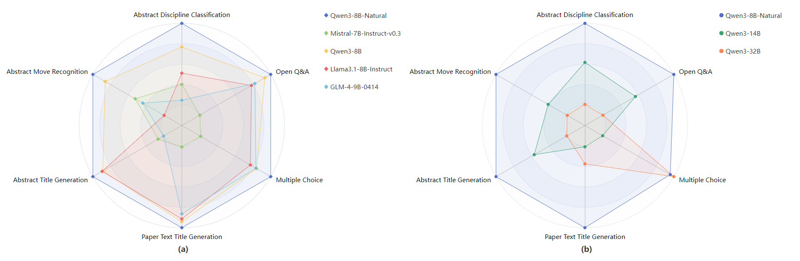

# NSLLM: 面向自然科学领域的学术大语言模型
# NSLLM: Natural Science Large Language Model

## 1. 模型概述
## 1. Model Overview

针对自然科学领域学术文本处理中存在的知识组织低效、专业内容理解不足等挑战，本研究构建了面向自然科学领域的学术大语言模型——**NSLLM**。

Addressing challenges such as inefficient knowledge organization and insufficient understanding of professional content in natural science academic text processing, this study constructed an academic large language model oriented towards the natural science domain—**NSLLM**

该模型基于 **Qwen3-8B-Base** 进行开发，通过引入海量自然科学领域文献进行“基础适应+领域深化”的两阶段继续预训练（Continue Pre-training），旨在平衡模型对旧知识的保留与新知识的习得，为自然科学领域的知识挖掘与科研辅助提供可行的技术路径。

Developing based on **Qwen3-8B-Base**, the model utilizes a massive amount of natural science literature for a two-stage "Basic Adaptation + Domain Deepening" continue pre-training strategy. It aims to balance the retention of old knowledge with the acquisition of new knowledge, providing a feasible technical path for knowledge mining and research assistance in the natural science domain.

---

## 2. 模型介绍
## 2. Introduction

### 数据来源
### Data Sources
研究首先构建了一个覆盖近50年自然科学领域的学术文本预训练语料库，包含超过 **1700万** 篇论文。数据主要来源于：

The study first constructed a pre-training corpus of academic texts covering nearly 50 years in the field of natural science, containing over **17 million** papers. The data is primarily sourced from:
* **Web of Science**
* **arXiv**
* **PubMed**
* **11个国际顶级学术会议 (11 Top International Academic Conferences)**

### 核心能力
### Core Capabilities
通过自然语言理解、自然语言生成及领域知识问答等维度的评测，NSLLM 展现出以下核心优势：

Through evaluations in dimensions such as natural language understanding, natural language generation, and domain knowledge Q&A, NSLLM demonstrates the following core advantages:
* **精准的领域适应性**：在摘要学科分类、摘要语步识别等对领域知识精准性要求较高的任务中表现显著。

    **Precise Domain Adaptability**: Performs significantly well in tasks requiring high precision in domain knowledge, such as abstract discipline classification and abstract move recognition.
* **高质量的学术生成**：生成的摘要不仅能复现研究方法与结论，还能通过句式重构提升学术规范性。

    **High-Quality Academic Generation**: The generated abstracts can not only reproduce research methods and conclusions but also enhance academic standardization through sentence restructuring.

---

## 3. 模型训练
## 3. Model Training

### 训练策略：两阶段继续预训练
### Training Strategy: Two-Stage Continue Pre-training
为了解决从头训练的高成本及灾难性遗忘问题，本研究采用了两阶段训练策略：

To address the high costs of training from scratch and the issue of catastrophic forgetting, this study adopted a two-stage training strategy:

1.  **第一阶段：基础适应 (Phase 1: Basic Adaptation)**
    * **内容**：利用自然科学领域标题与摘要语料。

        **Content**: Utilizes titles and abstracts from the natural science domain.
    * **设置**：以初始学习率预训练 200 步。

        **Settings**: Pre-trained for 200 steps with an initial learning rate.
    * **目标**：激活模型对科学术语的初步认知。

        **Goal**: Activate the model's preliminary cognition of scientific terminology.

2.  **第二阶段：领域深化 (Phase 2: Domain Deepening)**
    * **内容**：引入自然科学论文的主要实验部分内容。

        **Content**: Introduces the main experimental sections of natural science papers.
    * **目标**：进一步强化模型对于自然科学领域知识的认知能力，优化模型输出的逻辑严谨性。

        **Goal**: Further strengthen the model's cognitive ability regarding natural science domain knowledge and optimize the logical rigor of model outputs.

---

## 4. 模型效果
## 4. Model Performance

### 关键指标提升
### Key Metrics Improvement
与同参数规模的 **Qwen3-8B** 基座模型相比，**NSLLM** 取得了显著提升：

Compared to the **Qwen3-8B** base model of the same parameter scale, **NSLLM** achieved significant improvements:
* **摘要学科分类 (Abstract Discipline Classification)**: F1-Score 提升 **5.98** 个百分点 (Increased by 5.98 percentage points).
* **摘要语步识别 (Abstract Move Recognition)**: F1-Score 提升 **3.72** 个百分点 (Increased by 3.72 percentage points).
* **论文摘要生成 (Abstract Generation)**: BERTScore 达到 **66.18%**，较基座模型提升 **0.59** 个百分点 (BERTScore reached 66.18%, an increase of 0.59 percentage points over the base model).

### 下游任务对比
### Downstream Task Comparison
我们在六大下游任务中进行了广泛的对比验证：

We conducted extensive comparative validation across six major downstream tasks:

* **同参数量级对比 (Same Parameter Scale Comparison)**: NSLLM 在所有任务中均取得最优或接近最优表现，优于 Mistral-7B-Instruct, Llama3.1-8B-Instruct, GLM-4-9B 等通用模型。

    **Same Parameter Scale Comparison**: NSLLM achieved the best or near-best performance in all tasks, outperforming general models like Mistral-7B-Instruct, Llama3.1-8B-Instruct, and GLM-4-9B.
* **跨参数量级对比 (Cross Parameter Scale Comparison)**: 得益于海量领域数据的预训练，NSLLM 展现出极强的知识迁移能力，性能接近同系列更大参数模型 (Qwen3-14B, Qwen3-32B)。

    **Cross Parameter Scale Comparison**: Thanks to pre-training on massive domain data, NSLLM demonstrates strong knowledge transfer capabilities, with performance approaching that of larger models in the same series (Qwen3-14B, Qwen3-32B).

---

本研究验证了领域化训练对提升大语言模型专业能力的有效性。未来，我们将进一步探索跨学科数据融合与知识更新机制，以持续提升模型在科研辅助场景下的表现。

This study verifies the effectiveness of domain-specific training in enhancing the professional capabilities of large language models. In the future, we will further explore interdisciplinary data fusion and knowledge update mechanisms to continuously improve the model's performance in research assistance scenarios.

## 声明
## Disclaimer

大语言模型庞大的参数量也带来了更多的随机性，虽然我们在训练数据选取时已经尽可能保证了数据的合规性，但由于数据和模型的复杂性，仍有可能存在一些无法避免的问题。因此，如果由于使用本开源模型而导致的各种问题，包括但不限于数据安全问题、公共舆论风险，或模型被误导、滥用、传播或不当利用所带来的任何风险和问题，我们将不承担任何责任。

The vast parameter size of large language models introduces significant randomness. While we have strived to ensure data compliance during training data selection, unavoidable issues may still exist due to the complexity of the data and the model. Therefore, we assume no responsibility for any issues arising from the use of this open-source model, including but not limited to data security issues, public opinion risks, or any risks and problems caused by the model being misled, misused, disseminated, or improperly utilized.

此外，根据国家网信办等七部门联合发布的《生成式人工智能服务管理暂行办法》，在训练、使用本模型以及其他生成式模型，请依据相关法律法规，为构建和谐、健康、可持续的生成式人工智能社区共同努力。因此，如果由于使用本开源模型而导致的任何问题，包括但不限于数据安全问题、公共舆论风险，或模型被误导、滥用、传播或不当利用所带来的任何风险和问题，我们将不承担任何责任。

Furthermore, in accordance with the "Interim Measures for the Management of Generative Artificial Intelligence Services" jointly issued by the Cyberspace Administration of China and six other departments, please strictly adhere to relevant laws and regulations when training or using this model and other generative models. We call for joint efforts to build a harmonious, healthy, and sustainable generative AI community. Consequently, we assume no responsibility for any issues arising from the use of this open-source model, including but not limited to data security issues, public opinion risks, or any risks and problems caused by the model being misled, misused, disseminated, or improperly utilized.
